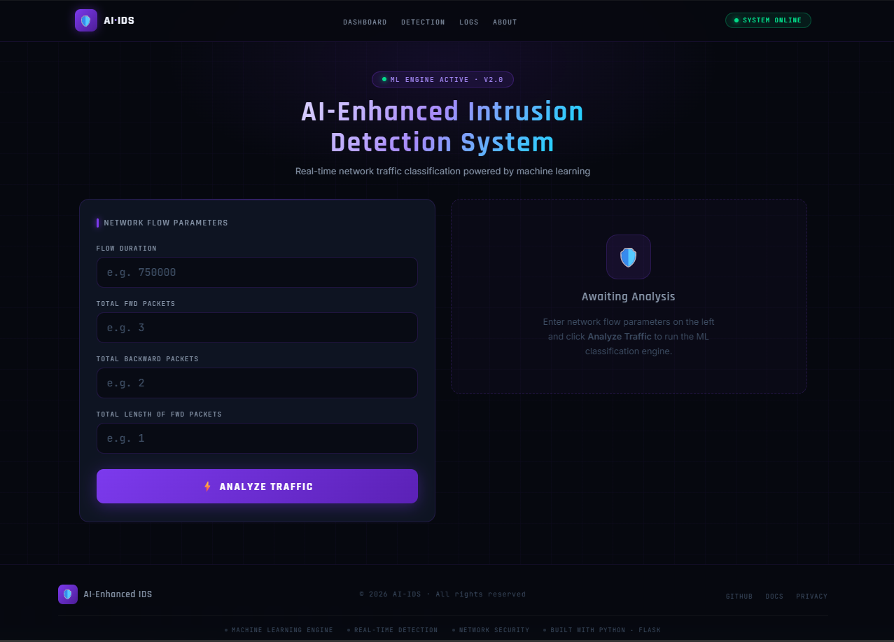
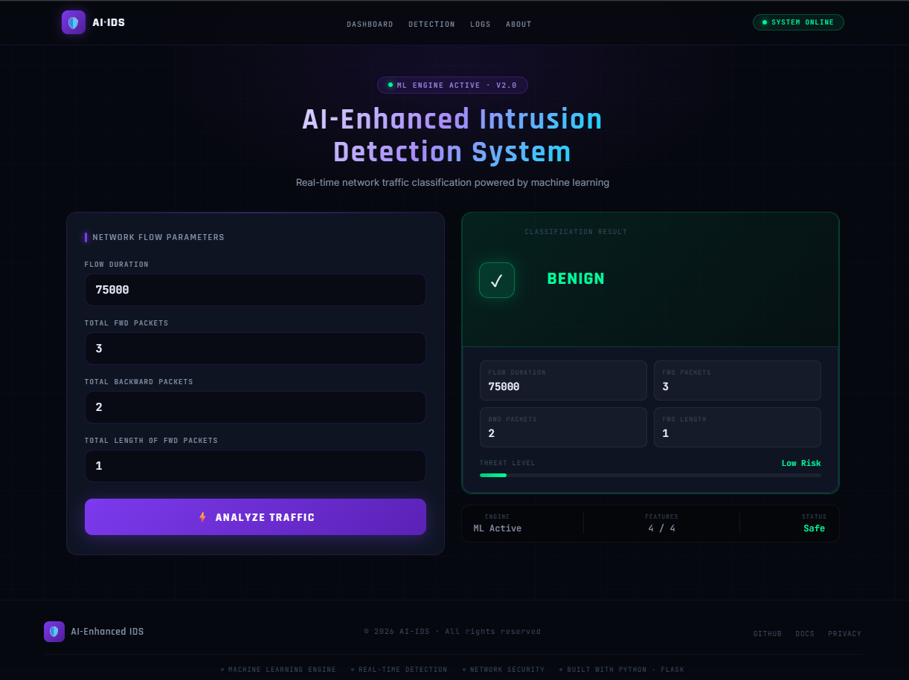
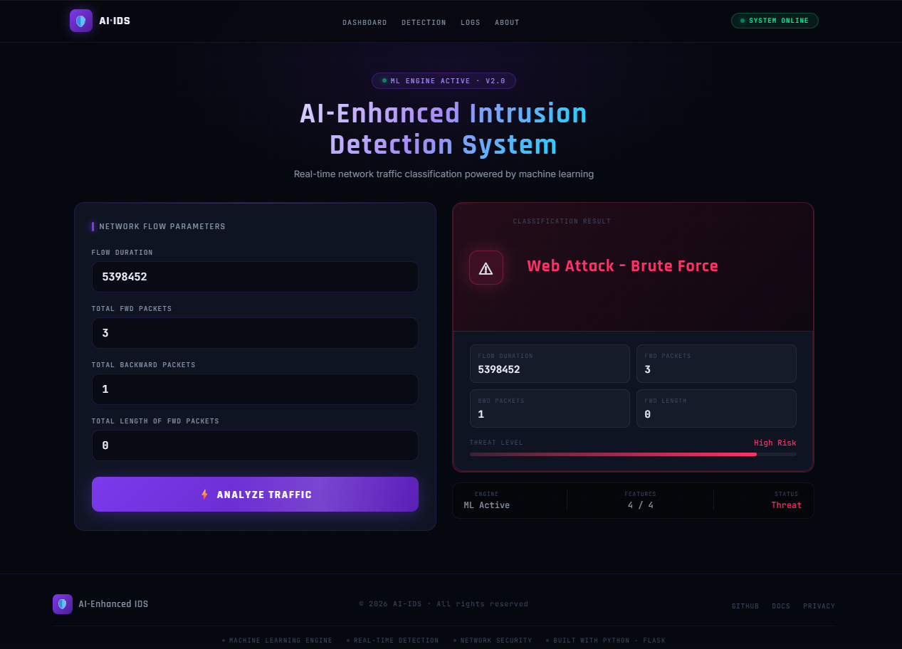

<div align="center">


<br/><br/>

# 🛡️ AI-Enhanced Intrusion Detection System

### *Real-time Network Threat Classification Powered by Machine Learning*

<br/>

[](https://www.python.org/)
[](https://flask.palletsprojects.com/)
[](https://scikit-learn.org/)
[](LICENSE)

</div>

---

## ◈ Overview

In today's hyper-connected digital landscape, network security is no longer optional — it's critical. The **AI-Enhanced Intrusion Detection System (IDS)** is a machine learning-powered web application that analyzes network traffic in real time and classifies it as **benign or malicious** with high accuracy.

Built on a **Random Forest Classifier** trained on a balanced intrusion dataset, the system provides an interactive web interface where security analysts or students can input network flow parameters and receive instant threat predictions — all powered by AI.

> *"Turning raw network data into actionable security intelligence."*

---

## ◈ Key Highlights

| | Feature | Detail |
|---|---|---|
| 🤖 | **ML Model** | Random Forest Classifier |
| ⚡ | **Prediction Speed** | Real-time, sub-second |
| 🎯 | **Input Features** | 4 network flow parameters |
| ⚖️ | **Dataset** | SMOTE-balanced for unbiased results |
| 🌐 | **Interface** | Premium responsive web UI |
| 🧩 | **Backend** | Python + Flask |
| 📁 | **Code Structure** | HTML · CSS · JS properly separated |

---

## ◈ System Workflow

```
  ┌─────────────┐     ┌──────────────┐     ┌─────────────────────┐     ┌──────────────┐
  │  User Input │────▶│  Flask API   │────▶│  Random Forest ML   │────▶│  Prediction  │
  │  (4 params) │     │  /predict    │     │  4-Feature Model    │     │  BENIGN /    │
  └─────────────┘     └──────────────┘     └─────────────────────┘     │  THREAT      │
                                                                         └──────────────┘
```

1. User enters network traffic values through the web interface
2. Flask backend receives and validates the input
3. Random Forest model processes the 4 features
4. Model predicts traffic classification
5. Result is displayed with animated threat level indicator

---

## ◈ Machine Learning Model

### Features Used for Classification

```python
features = [
    "Flow Duration",               # Total duration of the network flow (microseconds)
    "Total Forward Packets",       # Number of packets in the forward direction
    "Total Backward Packets",      # Number of packets in the backward direction
    "Total Length of Fwd Packets"  # Total byte size of forward packets
]
```

### Model Details

```
Algorithm    →  Random Forest Classifier
Training     →  web_attacks_balanced.csv (SMOTE balanced)
Model File   →  random_forest_model_4_features.joblib
Classes      →  BENIGN, Web Attack – Brute Force, XSS, SQL Injection, etc.
```

> The dataset was preprocessed using **SMOTE** to handle class imbalance and improve detection of rare attack patterns.

---

## ◈ Project Structure

```
CYBER_PROJECT/
│
├── 📁 templates/
│   └── 📄 index.html                        ← Clean HTML structure only (Jinja2)
│
├── 📁 static/
│   ├── 📁 css/
│   │   └── 🎨 style.css                     ← All styles & responsive rules
│   └── 📁 js/
│       └── ⚡ main.js                        ← Interactions, animations, auto-year
│
├── 🐍 app.py                                ← Flask routes & ML prediction logic
├── 🤖 random_forest_model_4_features.joblib ← Trained ML model
├── 📊 web_attacks_balanced.csv              ← Balanced training dataset
├── 📋 requirements.txt                      ← Python dependencies
├── 📓 Untitled.ipynb                        ← Model training notebook
└── 📄 README.md
```

> **Why separated?** HTML handles structure, CSS handles presentation, JS handles behavior — industry-standard separation of concerns. Each file has one job, making the project easier to maintain and extend.

---

## ◈ Tech Stack

<div align="center">

| Layer | Technology | Purpose |
|---|---|---|
| **Language** | Python 3.10+ | Core logic |
| **Framework** | Flask | Web backend & routing |
| **ML Library** | Scikit-Learn | Random Forest model |
| **Balancing** | Imbalanced-Learn (SMOTE) | Dataset balancing |
| **Data** | Pandas, NumPy | Data processing |
| **Model I/O** | Joblib | Model serialization |
| **Frontend** | HTML5 + CSS3 + JS | Responsive premium UI |
| **Fonts** | Google Fonts | Rajdhani, Inter, JetBrains Mono |
| **Notebook** | Jupyter | Model training & EDA |

</div>

---

## ◈ Installation & Setup

### 1 · Clone the Repository

```bash
git clone <repository-url>
cd CYBER_PROJECT
```

### 2 · Create Virtual Environment

```bash
# Windows
python -m venv venv
venv\Scripts\activate

# Linux / macOS
python3 -m venv venv
source venv/bin/activate
```

### 3 · Install Dependencies

```bash
pip install -r requirements.txt
```

> If the requirements file doesn't work:
> ```bash
> pip install flask pandas numpy scikit-learn joblib imbalanced-learn
> ```

### 4 · Run the Application

```bash
python app.py
```

### 5 · Open in Browser

```
http://127.0.0.1:5000
```

---

## ◈ Usage Example

| Parameter | Benign Example | Attack Example |
|---|---|---|
| Flow Duration | `750000` | `5389452` |
| Total Fwd Packets | `3` | `3` |
| Total Backward Packets | `2` | `1` |
| Total Length of Fwd Packets | `1` | `0` |
| **Result** | ✅ **BENIGN** | ⚠️ **Web Attack – Brute Force** |

---

## ◈ Objectives

- [x] Detect malicious network activities using Machine Learning
- [x] Classify traffic as normal or suspicious in real time
- [x] Provide a premium, responsive web interface for predictions
- [x] Improve detection accuracy using SMOTE-balanced datasets
- [x] Clean code structure — HTML / CSS / JS properly separated
- [x] Demonstrate AI integration with modern cybersecurity solutions

---

## ◈ Advantages & Limitations

**✅ Advantages**
- High classification accuracy on balanced data
- Fast, sub-second prediction speed
- Clean and intuitive cybersecurity dashboard
- Fully responsive — works on desktop & mobile
- Proper separation of HTML, CSS, and JS
- Easily extensible for new attack types

**⚠️ Limitations**
- Uses an offline static dataset (no live packet sniffing)
- No automatic threat response or alerting system
- Requires model retraining for new attack patterns
- Limited to 4 input features currently

---

## ◈ Screenshots

| Homepage | Benign Prediction | Threat Detection |
|:---:|:---:|:---:|
|  |  |  |

---

## ◈ Conclusion

The **AI-Enhanced Intrusion Detection System** demonstrates how machine learning can be applied to real-world cybersecurity challenges. By leveraging a Random Forest Classifier on a SMOTE-balanced dataset, the system accurately identifies suspicious network behavior across multiple attack categories.

This project serves as a strong foundation for building advanced, AI-powered security solutions capable of handling modern cyber threats — and can be extended toward real-time packet analysis, automated response, and multi-model ensemble detection.

---

<div align="center">

---

**Developed by**

### 👨‍💻 Mohammadkaif Mulla

*AI & Cybersecurity Enthusiast*

<br/>


---

*© 2026 AI-Enhanced IDS · Built with ❤️ using Python & Flask*

</div>
